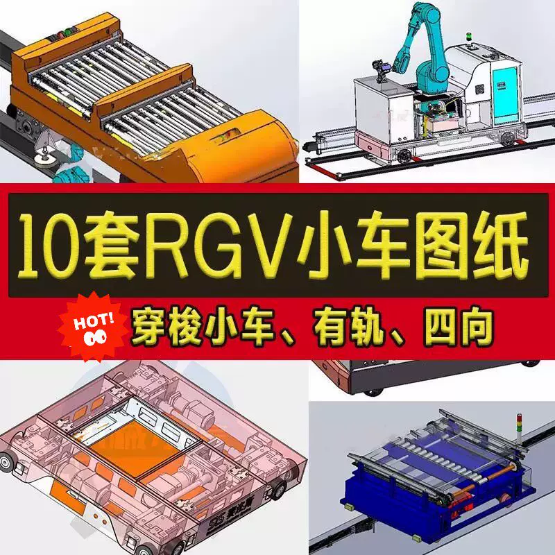
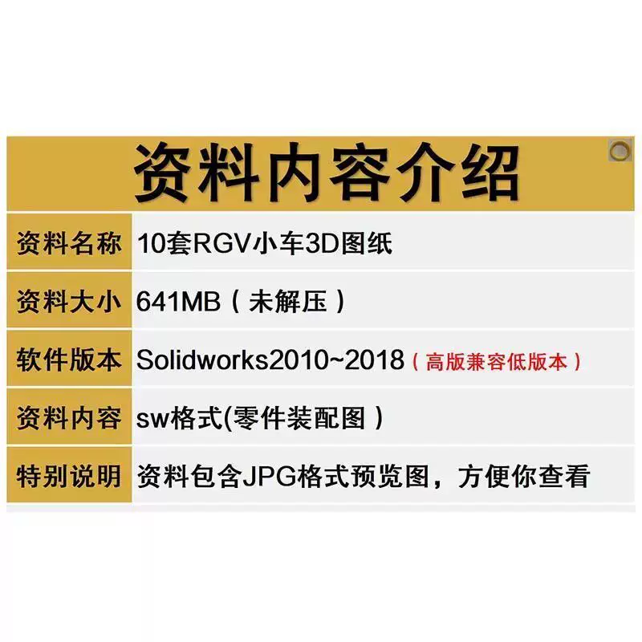
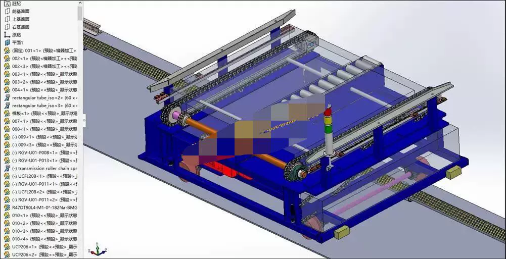
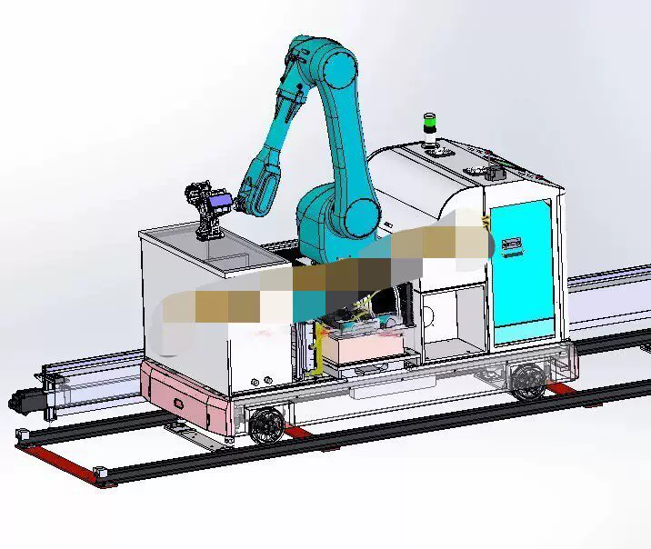
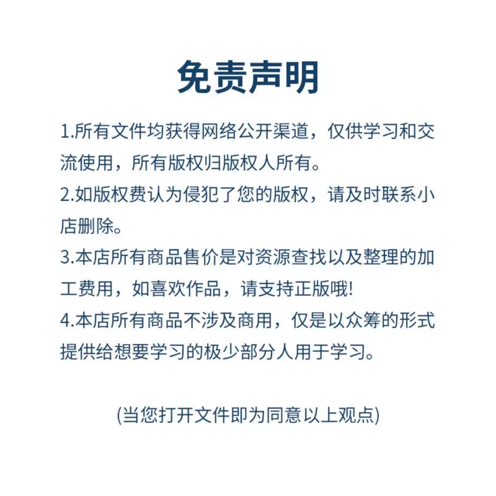

# 10 sets of 3D models for RGV carts, with rail-guided four-way shuttle car tracks and material for transferring goods

## Body

10 sets of RGV cart 3D model drawings with rail four-way shuttle car track guidance transfer vehicle material

(Full product description was not available from the source page.)

## Images

## Payment

Here is a pay link on Stripe ( https://buy.stripe.com/3cs8yP7sY87d0vu9AB ). Please contact me lonlonago@foxmail.com after funding $89, and I will send you a complete data files , thank you!

